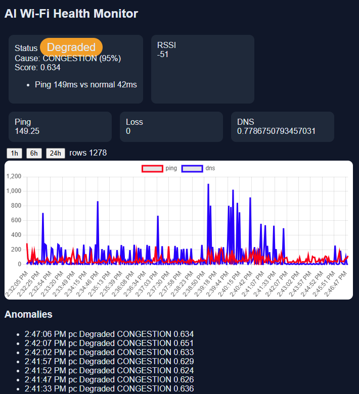

# Wifi Ranger — AI Wi-Fi Health Monitor

ESP32 + PC probes → FastAPI + SQLite → IsolationForest + RandomForest → live dashboard.



*Screenshot: live detection example — `Status: Degraded`, `Cause: CONGESTION (95%)`, `Score: 0.634`,
evidence `Ping 149ms vs normal 42ms`, RSSI `-51 dBm`, anomaly list filling with `pc / Degraded / CONGESTION` rows.
Ping (red) vs DNS (blue) history chart on top, 1,278 rows in view.*

## What it does

Continuously measures Wi-Fi health every 5 seconds and classifies problems in real time:

1. **Probes** collect `rssi, ping_ms, jitter_ms, loss_pct, dns_ms, down_mbps`.
2. **Backend** stores every reading in SQLite and runs live ML inference on each ingest.
3. **ML pipeline** scores anomaly severity (IsolationForest) and predicts root cause
   (RandomForest, 5 classes) with human-readable evidence.
4. **Dashboard** shows live cards, system status badge (`Normal / Degraded / Severe`),
   history charts, and a recent-anomalies table.

## Fault classes

| Label | How it was produced | Rows in `ml/dataset_clean.csv` |
|---|---|---:|
| `NORMAL` | everyday home network | 11,930 |
| `WIFI_WEAK` | ESP32 far from router (bedroom, powerbank) | 400 |
| `CONGESTION` | 2×4K streams + 1 GB download | 395 |
| `PACKET_LOSS` | Clumsy 10% loss on PC (`tc netem` equivalent) | 337 |
| `DNS_PROBLEM` | dead resolver `192.0.2.1` on PC | 352 |
| **Total** | | **13,414** |

Label windows are logged in `data/notes.txt` (4 fault runs on 2026-09-30).
By probe: `esp32-1: 11,554`, `pc: 1,860`.

## Architecture

```text
firmware/probe/probe.ino (ESP32, 5s) ─┐
                                      ├─POST /ingest ─► backend/main.py ─► data/monitor.db
backend/pc_probe.py (PC, 5s) ─────────┘                          │
                                                        analyze_probe() per ingest
                                                        12-row window → 41 feats
                                                        → scaler → IsolationForest score
                                                        → RandomForest cause + evidence
                                                                 │
dashboard/index.html (Chart.js, 4s poll) ◄── /latest ────────────┤
                           ◄── /analysis/latest, /anomalies, /history
```

## Models (`ml/`)

Tracked in git so anyone can run live inference without training:

* `scaler.joblib` — `StandardScaler` over 41 rolling features
* `isoforest.joblib` — `IsolationForest(n_estimators=200, contamination=0.05)`, trained on `NORMAL` only
* `rf.joblib` — `RandomForestClassifier(n_estimators=300, min_samples_leaf=2, class_weight=balanced)`, 5-class
* `labels.joblib` — label encoder
* `dataset_clean.csv` — full cleaned dataset (13,414 rows)

Features per probe (`backend/main.py:compute_features`, `ml/prototype.py`):
5 signals (`rssi, ping_ms, jitter_ms, loss_pct, dns_ms`) × 2 windows (6 rows ≈ 30 s, 12 rows ≈ 60 s)
× 4 stats (mean/std/min/max) = 40, plus `rssi_slope` = **41**.

Live logic (`backend/main.py`):
* needs ≥ 3 recent rows for the probe, uses last 12
* anomaly score = `-iso.score_samples(X)`; threshold `THR = 0.62` (≈ 95th pct of NORMAL validation)
* `score < THR` → `Normal / NORMAL (0.95)`; else RF `predict_proba` → cause (or `Unknown` if confidence < 0.50),
  `Degraded` if `score < THR*1.5` else `Severe`
* evidence compares current reading to `NORM_MED (rssi -58 dBm, ping 42 ms, jitter 30 ms, loss 0.5%, dns 50 ms)`

Training (`ml/prototype.py`): clean → rolling features → **time split 70/15/15, no shuffle**
(classifier uses per-label time split so train sees every fault) → scaler → IF + RF → `roc_iso.png`.
Re-run it after collecting your own labels, then restart the backend to pick up new models.

## Quick run

Prereqs: Python 3.10+, Arduino IDE (for ESP32 only), 2.4 GHz Wi-Fi.

```powershell
# 1. env
python -m venv .venv
.\.venv\Scripts\Activate.ps1        # Linux/Mac: source .venv/bin/activate
pip install -r requirements.txt

# 2. backend (allow firewall for port 8000, note your PC IP, e.g. 192.168.0.105)
python -m uvicorn backend.main:app --host 0.0.0.0 --port 8000

# 3. PC probe (new terminal, backend must be up first)
$env:SERVER_URL="http://127.0.0.1:8000/ingest"
python backend/pc_probe.py

# 4. ESP32 probe (optional, Arduino IDE, install ArduinoJson + ESP32Ping libs)
# Flash firmware/probe/probe.ino after setting:
#   WIFI_SSID, WIFI_PASS, SERVER_URL=http://<PC-IP>:8000/ingest
# Power via USB / powerbank.

# 5. verify
curl http://127.0.0.1:8000/latest
curl http://127.0.0.1:8000/analysis/latest

# 6. dashboard — backend serves API only, so serve the page separately:
cd dashboard; python -m http.server 8080
# open http://<PC-IP>:8080 — it auto-calls the API on <same-host>:8000, refresh 4 s

# 7. label your own faults + train
curl -X POST http://127.0.0.1:8000/label -H "Content-Type: application/json" -d '{"label":"CONGESTION"}'
python ml/prototype.py   # → new ml/*.joblib + roc_iso.png, restart backend
```

Windows-only notes: `pc_probe.py` uses `ping -n/-w` and `netsh wlan show interfaces` for RSSI.
On Linux/Mac ping flags differ and RSSI returns `None` (backend tolerates it, but retrain locally).
PC download test fetches `https://proof.ovh.net/files/10Mb.dat` every 5 min.

## API

| Method | Endpoint | Purpose |
|---|---|---|
| POST | `/ingest` | probe reading → stored with current label → live analysis returned |
| GET | `/latest?probe_id=` | newest measurement |
| GET | `/history?hours=` | measurements since N hours ago |
| GET | `/analysis/latest?probe_id=` | newest analysis row |
| GET | `/anomalies?hours=` | non-Normal analyses, newest first (max 200) |
| POST/GET | `/label` | set/get current training label |

`Measurement` fields: `probe_id, ts?, rssi?, ping_ms?, jitter_ms?, loss_pct?, dns_ms?, down_mbps?, up_mbps?`
(`dns_ms: null` = timeout → filled as 5000 ms fault signal.)

## Project structure

```text
backend/main.py        FastAPI + SQLite + live inference
backend/pc_probe.py    PC probe (ping/DNS/RSSI/speed, 5 s, offline buffer)
firmware/probe/        ESP32 probe.ino (edit SSID/PASS/SERVER_URL, flash)
ml/prototype.py        training: clean → features → split → IF + RF
ml/*.joblib            pretrained models (tracked)
ml/dataset_clean.csv   full dataset (tracked)
dashboard/index.html   single-file Chart.js UI
data/notes.txt         fault windows log (tracked); data/*.db ignored
docs/screenshot.png    dashboard screenshot (this file)
```

## Limitations

* Models overfit this home/network; expect drift on other networks (even night→day ping shifts here).
* PC-only mode is blind to `WIFI_WEAK` (needs ESP32 RSSI); ESP32 is 2.4 GHz only.
* Faults are artificial (Clumsy, dead DNS, far-room, streaming load).
* No auth on API; LAN-only use. `data/*.db`, `.venv/`, `ml/*.png` stay gitignored.

## Saving the screenshot

The image at the top loads from `docs/screenshot.png`.
To reproduce: save the dashboard screenshot from this chat as `docs/screenshot.png` and commit.
